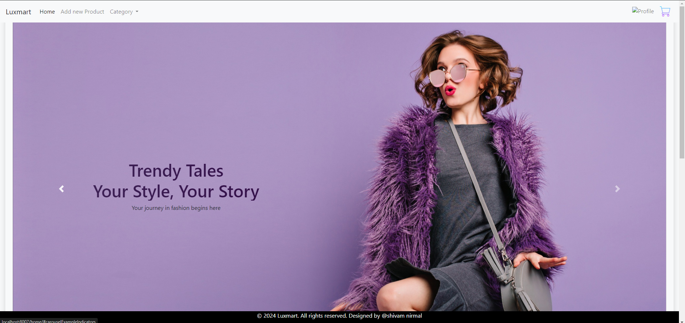
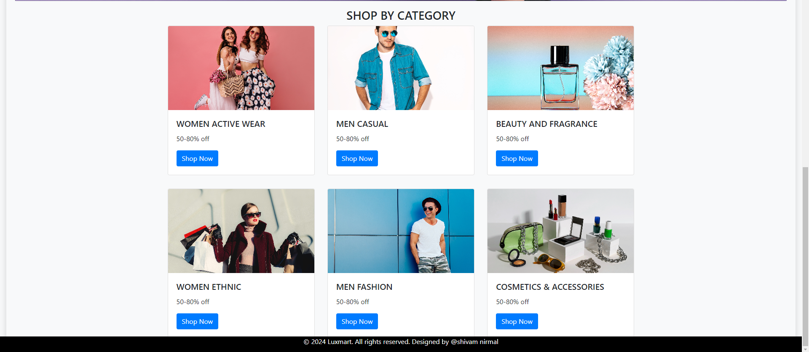
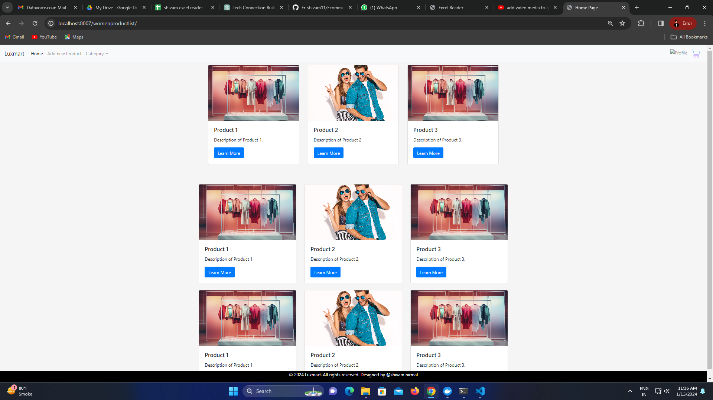
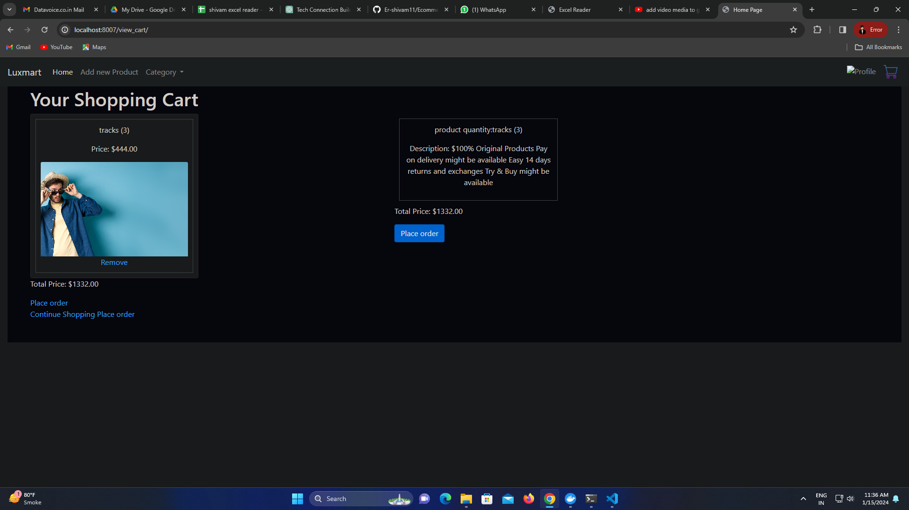

# Django Ecommerce Project

Developed a Django CRUD application for an online fashion store catering to both men and women. The application allows users to browse and view fashion products, search for specific items, and perform CRUD operations such as creating, updating, and deleting product listings based on RBAC(role based access control). The application uses a database to store the product listings, and Django models to interact with the database. Django views handle user requests and render HTML templates. Django forms allow users to create and update product listings. Django authentication and authorization protect the web application from unauthorized access. The application also includes a search feature that allows users to search for products based on their criteria.

## Features
- Product browsing and viewing
- Product search functionality
- Product creation, update, and deletion
- User registration and login
- Admin panel for managing products and users

## Technologies Used
The UI is built using the following technologies:
- Python 3.6+
- Django 3.2+
- HTML/CSS
- Bootstrap

## output






## How to Use
 To use this UI, follow these steps:

 **Clone the repository:**
   ```bash
   git clone https://github.com/Er-shivam11/Ecommerce.git
   cd Ecommerce
pip install -r requirements.txt
python manage.py make migrations , python manage.py migrate, python manage.py runserver.
Then, open a browser and navigate to http://localhost:4200/ to view the UI.
 


